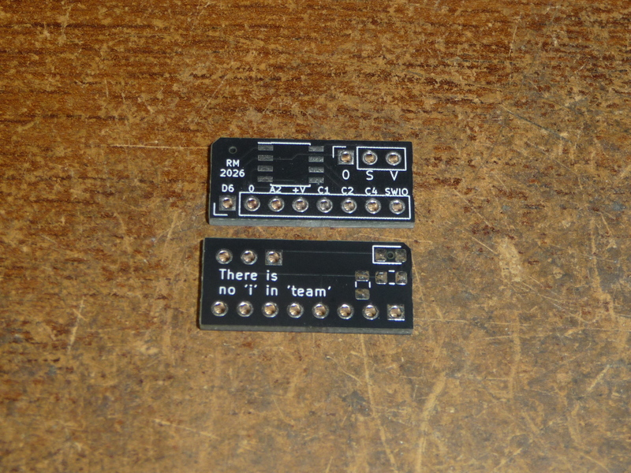
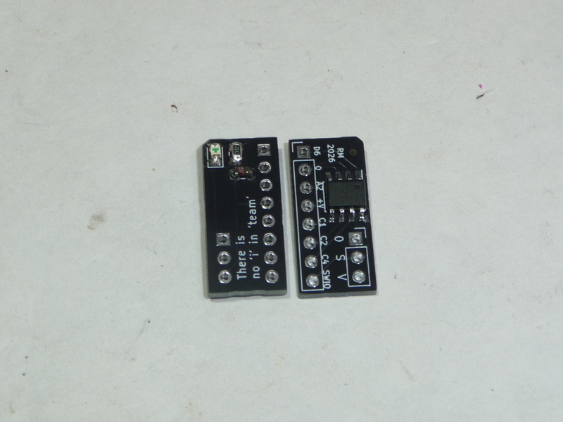
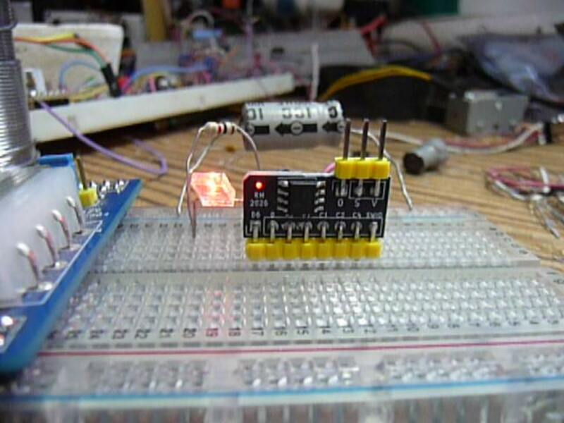

# CH32V003 breakout

The intent of this board is something that can have wires soldered to the pads and be glued into simple devices.
It breaks out all the ch32 pins, has a decoupling cap, a power LED and a programming header.

I soldered the test unit as a SIP module.

As normal for me, I have removed most of the silk screen. 
Be careful of where pin 1 of the ch32 goes. The edge pins are numbered 1:1 with the ch32.

The LED is reverse mounted to shine thru the hole. I wanted to try this on a manufactured pcb, 
but the hole is small and it didn't work out as awesome as it does on protoboard.

I used a 3.3k resistor for the LED. I reccomend 2.2k, but with bright LEDs 10k is probably fine.

The capacitor is decoupling, so any 0805 between 0.01uF and 3F should do.

I included the gerbers, but jokes on you, kicad didn't backport their versions far enough and I'm using 
5.1.9 haha!

